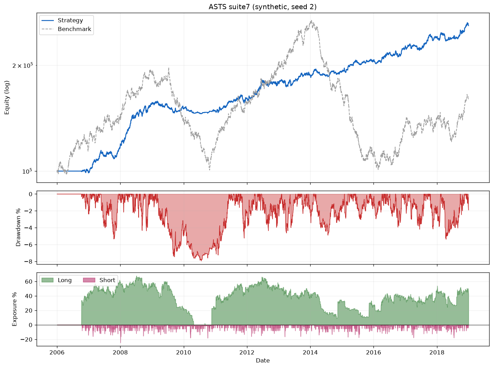

# Automated Stock Trading Systems (ASTS)

A research-grade Python backtesting engine that implements the **seven
non-correlated trading systems** described in Laurens Bensdorp's book
*[Automated Stock Trading Systems: A Systematic Approach for Traders to Make
Money in Bull, Bear and Sideways Markets](https://www.tradingmasteryschool.com/)*
(Lioncrest, 2020).

The thesis of the book — and of this repo — is simple: a single edge is fragile,
but **combining several conceptually different, non-correlated systems** (long &
short, trend-following & mean-reversion) smooths the equity curve, slashes
drawdowns, and lifts risk-adjusted return well above buy-and-hold.

> ⚠️ **Not investment advice.** Research/education only. Backtested performance
> does not predict future results. See `LICENSE`.

---

## Highlights

- **All 7 systems** implemented from the book's 12-ingredient template
  (`docs/systems_spec.md`), plus the three combined suites (Ch. 7 / 9 / 10).
- **Event-driven daily engine** with faithful *next-day* execution: limit &
  market orders, ATR stop-losses, percentage trailing stops, profit targets and
  time-based exits, slippage and commission.
- **Bensdorp position sizing**: combined 2% percent-risk + 10% percent-size cap,
  max 10 positions per system, per-system capital allocations.
- **Runs fully offline** on a reproducible synthetic universe — no data vendor
  or API key required — with an optional `yfinance` loader for real data.
- **Tested** (22 unit + integration tests) and **typed**, with a clean
  `TradingSystem` abstraction so adding an 8th system is a single small file.

## Architecture

```
src/asts/
├── indicators.py          # SMA, RSI, ATR, ADX, ROC, hist-vol (Wilder smoothing)
├── core/
│   ├── types.py           # Direction, Order, Position, Trade, SizingParams ...
│   ├── position_sizing.py # percent-risk ⊓ percent-size
│   ├── system.py          # 12-ingredient TradingSystem ABC + Bars view
│   ├── portfolio.py       # cash / positions / trade ledger / equity curve
│   └── engine.py          # event-driven daily backtest loop
├── systems/               # system1..system7 + named suites (build_suite)
├── data/
│   ├── features.py        # precompute the canonical indicator set
│   ├── synthetic.py       # offline reproducible OHLCV universe
│   └── yahoo.py           # optional yfinance loader (cached to Parquet)
├── analysis/              # robustness: montecarlo, sensitivity, walkforward
├── metrics.py             # CAGR, MaxDD, MAR, Sharpe, win-rate, payoff, exposure
├── plotting.py            # 3-panel tear sheet (optional, matplotlib)
├── backtest.py            # high-level run_backtest(...) API
└── cli.py                 # run / montecarlo / sensitivity / walkforward / list
```

## Install

The core depends only on `pandas`, `numpy` and `pyyaml`.

```bash
python -m venv .venv && source .venv/bin/activate
pip install -e .            # core
pip install -e ".[data]"    # + yfinance for real market data
pip install -e ".[dev]"     # + pytest / ruff
```

No network? The repo ships a synthetic data generator, so everything below runs
without installing the `data` extra.

## Quick start

```bash
# List systems and suites
asts list

# Full 7-system suite on offline synthetic data
asts run --suite suite7 --synthetic

# A single system, larger synthetic universe
asts run --suite s1 --synthetic --stocks 80 --start 2008-01-01 --end 2018-12-31

# Real data via yfinance (needs the [data] extra)
asts run --suite suite6 --symbols AAPL,MSFT,NVDA,AMD,JPM,XOM \
    --start 2010-01-01 --end 2019-12-31 --csv equity.csv --trades-csv trades.csv

# Render a tear sheet (equity vs benchmark / drawdown / exposure)
asts run --suite suite7 --synthetic --plot results/suite7.png
```

### Examples

| Script | What it shows |
|---|---|
| `examples/run_suite.py` | Every system vs the combined suites (the diversification table below) |
| `examples/custom_system.py` | Adding an 8th system (Donchian breakout) in ~20 lines |
| `examples/real_data.py` | Running `suite6` on real yfinance data (cached to CSV) |
| `examples/robustness.py` | Monte Carlo + sizing sensitivity + walk-forward |

### Tear sheet

`--plot` (or `asts.plotting.plot_tearsheet`) renders a three-panel sheet — the
strategy equity (log) against the benchmark, the underwater drawdown curve, and
net long/short exposure:



Or from Python:

```python
from asts import run_backtest, build_suite, format_metrics
from asts.data.synthetic import make_universe

universe = make_universe(n_stocks=40, start="2006-01-01", end="2018-12-31", seed=2)
out = run_backtest(build_suite("suite7"), universe)
print(format_metrics(out.metrics))
```

### Example: diversification in action

`python examples/run_suite.py` (synthetic data, seed 2) — individual edges are
modest and uneven, but the combined suites roughly *double* the MAR while
cutting max drawdown by ~3×:

| strategy | CAGR% | MaxDD% | MAR | Sharpe | Bench. corr |
|---|--:|--:|--:|--:|--:|
| s1 Long Trend High Momentum | 14.42 | -27.95 | 0.52 | 0.84 | 0.035 |
| s4 Long Trend Low Vol | 6.42 | -17.34 | 0.37 | 0.67 | 0.101 |
| s7 Catastrophe Hedge | 1.17 | -32.07 | 0.04 | 0.20 | **-0.575** |
| **suite3** (Ch. 7) | 11.49 | -11.37 | **1.01** | 1.16 | 0.029 |
| **suite6** (Ch. 9) | 7.91 | -8.07 | 0.98 | **1.21** | 0.063 |
| **suite7** (Ch. 10) | 7.60 | -7.94 | 0.96 | 1.19 | 0.052 |

Note the catastrophe hedge's strongly *negative* benchmark correlation — it is
designed to lose a little most of the time and pay off in crashes.

> Absolute numbers depend on the (synthetic) data and **will not** match the
> book, which uses the real survivorship-bias-free 1995–2019 universe. The
> *qualitative* signatures reproduce faithfully (see `docs/systems_spec.md`).

## Robustness & validation

A single backtest is one lucky path. The `analysis` package adds the three
checks a professional process requires (full guide:
**[`docs/robustness.md`](docs/robustness.md)**):

```bash
asts montecarlo  --suite suite6 --synthetic --sims 2000   # outcome distribution + tail risk
asts sensitivity --suite suite6 --synthetic               # sizing trade-off grid (Ch. 5)
asts walkforward --suite suite6 --synthetic               # tune in-sample, validate OOS
```

- **Monte Carlo** — block/iid bootstrap of daily returns → percentiles of
  CAGR/MaxDD and `P(maxDD < −20%)`, `P(loss)`.
- **Sizing sensitivity** — same rules, varied `risk_pct`×`max_pct_size`; CAGR and
  drawdown rise together, reproducing the book's Chapter 5 point.
- **Walk-forward** — optimizes the percent-risk lever in-sample, validates
  out-of-sample, and compares against a fixed-2% baseline to expose overfitting.

## The seven systems

| # | Name | Dir | Style |
|---|------|-----|-------|
| 1 | Long Trend High Momentum | long | trend |
| 2 | Short RSI Thrust | short | mean reversion |
| 3 | Long Mean Reversion Selloff | long | mean reversion |
| 4 | Long Trend Low Volatility | long | trend |
| 5 | Long Mean Reversion High ADX Reversal | long | mean reversion |
| 6 | Short Mean Reversion High Six-Day Surge | short | mean reversion |
| 7 | Catastrophe Hedge (SPY only) | short | trend |

Full rule tables are in **[`docs/systems_spec.md`](docs/systems_spec.md)**.

## Adding your own system

Subclass `TradingSystem`, implement `entry_signal` / `exit_signal` (and
optionally `market_filter`), and register it. The engine handles sizing, stops,
trailing stops and accounting for you.

```python
from asts.core.system import TradingSystem, CandidateSpec, ExitSpec
from asts.core.types import Direction, OrderType, Style

class MyBreakout(TradingSystem):
    name = "My Breakout"; direction = Direction.LONG; style = Style.TREND
    def entry_signal(self, b, i):
        if b.close[i] == b.close[max(0, i-19):i+1].max():   # 20-day high
            return CandidateSpec(rank_value=b.roc_200[i], order_type=OrderType.MARKET_ON_OPEN,
                                 stop_atr_mult=3.0, atr=b.atr_20[i], reference_price=b.close[i])
        return None
    def exit_signal(self, pos, b, i):
        return None  # managed by ATR stop
```

## Testing

```bash
pytest            # 22 tests: indicators, sizing, accounting, engine integration
```

## Disclaimer

This project is an independent, educational reimplementation of publicly
described strategies. It is **not** affiliated with or endorsed by the author or
publisher. Nothing here is financial advice.
