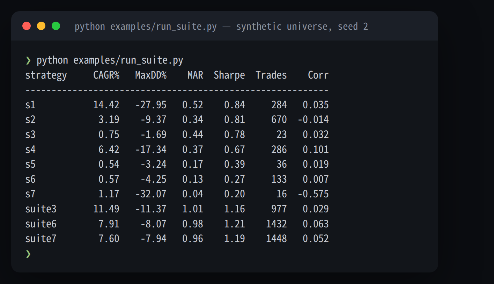
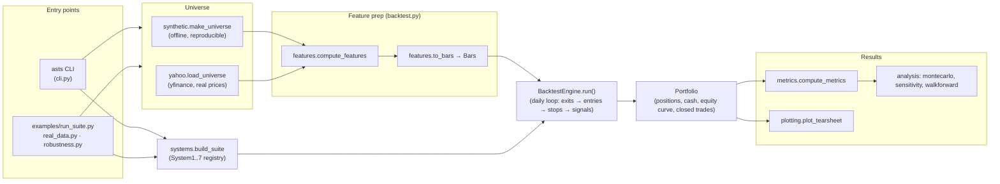

# Automated Stock Trading Systems (ASTS)

[](https://github.com/younghwan91/automated-stock-trading-systems/actions/workflows/ci.yml)
[](https://www.python.org/)
[](LICENSE)
[](https://www.linkedin.com/in/younghwan-chae/)

An educational Python backtester for the **seven non-correlated trading
systems** in Laurens Bensdorp's *Automated Stock Trading Systems* (Lioncrest,
2020). Runs offline on a synthetic universe — no data vendor, no API key.

> ⚠️ **Not investment advice.** Research and education only. See
> [`DISCLAIMER.md`](DISCLAIMER.md).

## Why seven systems

A single edge is fragile. The book's argument is that conceptually different
systems — long and short, trend-following and mean-reversion — draw down at
different times, so running them together smooths the equity curve.

That is the claim this repo tests, and on the synthetic universe it holds: every
individual system lands under MAR 0.6, every combined suite clears 0.95, and max
drawdown drops ~3× against the strongest single system.



Full table, tear sheet, and the Monte Carlo / sensitivity / walk-forward
checks: **[`docs/results.md`](docs/results.md)**.

## Quick start

```bash
pip install -e .          # core: pandas, numpy, pyyaml
pip install -e ".[data]"  # + yfinance, for real prices

asts list                            # systems and suites
asts run --suite suite7 --synthetic  # all 7, offline
python examples/run_suite.py         # the comparison pictured above
asts run --suite suite6 --symbols AAPL,MSFT,JPM --start 2010-01-01 --end 2019-12-31
```

From Python: `run_backtest(build_suite("suite7"), universe)`, where `universe` is a
`{symbol: OHLCV DataFrame}` dict — see `examples/run_suite.py` for a full working
example (imports, `make_universe`).

## What's inside

An event-driven daily engine with next-day execution, protective stops,
slippage/commission modeling, and Bensdorp-style position sizing (2%
percent-risk, max 10 positions/system). Rule tables for all seven systems:
[`docs/systems_spec.md`](docs/systems_spec.md). `examples/custom_system.py`
shows how to add your own by subclassing `TradingSystem`.

## Architecture

`run_backtest()` (`backtest.py`) wires everything together as the single
high-level entry point: universe → features/bars → `BacktestEngine` →
`Portfolio` → `Metrics`. The CLI (`asts run|montecarlo|sensitivity|walkforward|list`)
and the scripts under `examples/` are thin callers of the same function.


```mermaid
flowchart LR
    subgraph Entry["Entry points"]
        CLI["asts CLI\n(cli.py)"]
        EX["examples/run_suite.py\nreal_data.py · robustness.py"]
    end

    subgraph Data["Universe"]
        SYN["synthetic.make_universe\n(offline, reproducible)"]
        YHO["yahoo.load_universe\n(yfinance, real prices)"]
    end

    subgraph Prep["Feature prep (backtest.py)"]
        FEAT["features.compute_features"]
        BARS["features.to_bars → Bars"]
    end

    SYS["systems.build_suite\n(System1..7 registry)"]

    ENG["BacktestEngine.run()\n(daily loop: exits → entries → stops → signals)"]

    PF["Portfolio\n(positions, cash, equity curve, closed trades)"]

    subgraph Output["Results"]
        MET["metrics.compute_metrics"]
        PLOT["plotting.plot_tearsheet"]
        AN["analysis: montecarlo, sensitivity, walkforward"]
    end

    CLI --> Data
    EX --> Data
    SYN --> FEAT
    YHO --> FEAT
    FEAT --> BARS
    CLI --> SYS
    EX --> SYS
    BARS --> ENG
    SYS --> ENG
    ENG --> PF
    PF --> MET
    PF --> PLOT
    MET --> AN
```

## Development

```bash
pip install -e ".[dev]" && pytest    # 31 tests
```

## Limits

- The default universe is **synthetic** — reproducible and survivorship-bias-free
  by construction, but not the market. Read the numbers as evidence the code
  implements the rules, not as performance.
- The `yfinance` loader gives real prices but a survivorship-biased universe:
  delisted names are absent, so those results skew optimistic.
- No live trading, no broker integration, no intraday data.

## Attribution and license

The strategies are Laurens Bensdorp's, described in
*[Automated Stock Trading Systems: A Systematic Approach for Traders to Make
Money in Bull, Bear and Sideways Markets](https://www.tradingmasteryschool.com/)*
(Lioncrest Publishing, 2020). This is an independent reimplementation from the
book's published rule descriptions, for study — no text, code, or data from the
book is reproduced here, and the project is **not** affiliated with or endorsed
by the author or publisher. If the systems interest you, buy the book.

Code is MIT ([`LICENSE`](LICENSE)). Backtested performance does not predict
future results.

---

**Younghwan Chae** · [GitHub @younghwan91](https://github.com/younghwan91) · [LinkedIn](https://www.linkedin.com/in/younghwan-chae/) · [Issues](https://github.com/younghwan91/automated-stock-trading-systems/issues)
