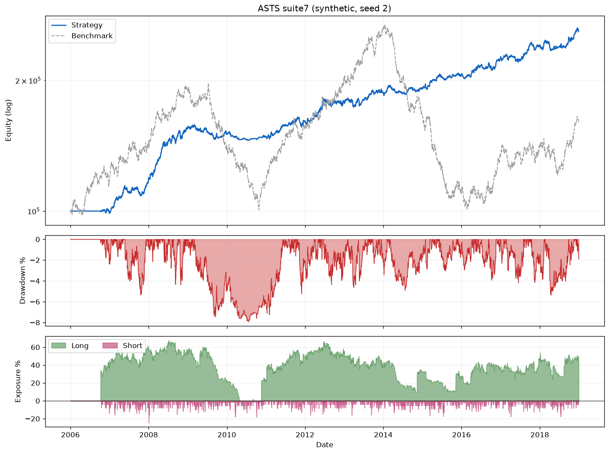

# Results on the synthetic universe

Everything here comes from `python examples/run_suite.py` — 41 synthetic
symbols, 2005-01-03 → 2019-12-31, seed 2. It is **not** a claim about live
trading, and the numbers are not a recommendation to trade anything. Their only
job is to show that the suites behave the way the book says they should.

## Per-system and combined

| strategy | CAGR% | MaxDD% | MAR | Sharpe | Trades | Bench. corr |
|---|--:|--:|--:|--:|--:|--:|
| s1 Long Trend High Momentum | 14.42 | -27.95 | 0.52 | 0.84 | 284 | 0.035 |
| s2 Short RSI Thrust | 3.19 | -9.37 | 0.34 | 0.81 | 670 | -0.014 |
| s3 Long MR Selloff | 0.75 | -1.69 | 0.44 | 0.78 | 23 | 0.032 |
| s4 Long Trend Low Vol | 6.42 | -17.34 | 0.37 | 0.67 | 286 | 0.101 |
| s5 Long MR High ADX Reversal | 0.54 | -3.24 | 0.17 | 0.39 | 36 | 0.019 |
| s6 Short MR Six-Day Surge | 0.57 | -4.25 | 0.13 | 0.27 | 133 | 0.007 |
| s7 Catastrophe Hedge | 1.17 | -32.07 | 0.04 | 0.20 | 16 | **-0.575** |
| **suite3** (Ch. 7) | 11.49 | -11.37 | **1.01** | 1.16 | 977 | 0.029 |
| **suite6** (Ch. 9) | 7.91 | -8.07 | 0.98 | **1.21** | 1432 | 0.063 |
| **suite7** (Ch. 10) | 7.60 | -7.94 | 0.96 | 1.19 | 1448 | 0.052 |

Two things to read off it:

- **Combining beats picking.** No individual system reaches MAR 0.6; every
  combined suite clears 0.95, and max drawdown drops by roughly 3× against the
  best single system.
- **The hedge earns its keep by losing.** System 7 is the worst standalone line
  in the table (MAR 0.04) and the only one with strongly negative benchmark
  correlation. It is built to bleed most of the time and pay in crashes.

Absolute numbers depend on the synthetic data and **will not** match the book,
which uses a real survivorship-bias-free 1995–2019 universe. What reproduces is
the qualitative signature of each system — direction, holding period, win rate,
correlation sign. The rule tables are in [`systems_spec.md`](systems_spec.md).

## Tear sheet

`asts run --suite suite7 --synthetic --plot results/suite7.png` renders equity
against the benchmark (log), the underwater drawdown curve, and net long/short
exposure:



## Robustness checks

One backtest is one lucky path. `python examples/robustness.py`, or:

```bash
asts montecarlo  --suite suite6 --synthetic --sims 2000   # outcome distribution, tail risk
asts sensitivity --suite suite6 --synthetic               # sizing trade-off grid (Ch. 5)
asts walkforward --suite suite6 --synthetic               # tune in-sample, validate OOS
```

- **Monte Carlo** — block/iid bootstrap of daily returns → percentiles of
  CAGR/MaxDD plus `P(maxDD < −20%)` and `P(loss)`.
- **Sizing sensitivity** — same rules, varied `risk_pct` × `max_pct_size`. CAGR
  and drawdown rise together, which is the Chapter 5 point.
- **Walk-forward** — optimizes the percent-risk lever in-sample, validates
  out-of-sample, and compares against a fixed-2% baseline to expose overfitting.

Full guide: [`robustness.md`](robustness.md).
